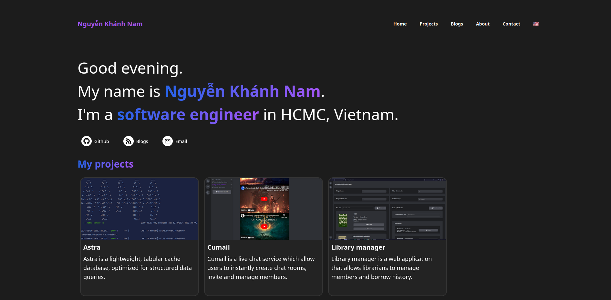

# Portfolio



Live at: https://nguyen-khanh-nam.netlify.app/

## Technologies used

- NodeJS
- ReactJS
- Typescript
- TailwindCSS
- Vite
- Pocketbase
- Nginx

## Features

- Modern tech stack
- Minimal, but functional design
- Responsive
- Support multiple languages (English and Vietnamese in this case)
- Easy to customize

## How to use this project

To preview this project on your browser, run 
```bash
npm run dev
```

In case you want to run it in a docker container, run
```bash
docker build -t your_tag:latest .
```

To be able to use the blogging feature, first import the collection schema at `pb_collections.json` into your Pocketbase app.

Create a `.env` file and add your Pocketbase URL:

```
VITE_POCKETBASE_URL=https://your-pocketbase-url.com/
```

To build the Docker image with blogging enabled, simply add this build flag:

```shell
docker build --build-arg VITE_POCKETBASE_URL=https://your-pocketbase-url.com/ -t your_tag:latest .
```